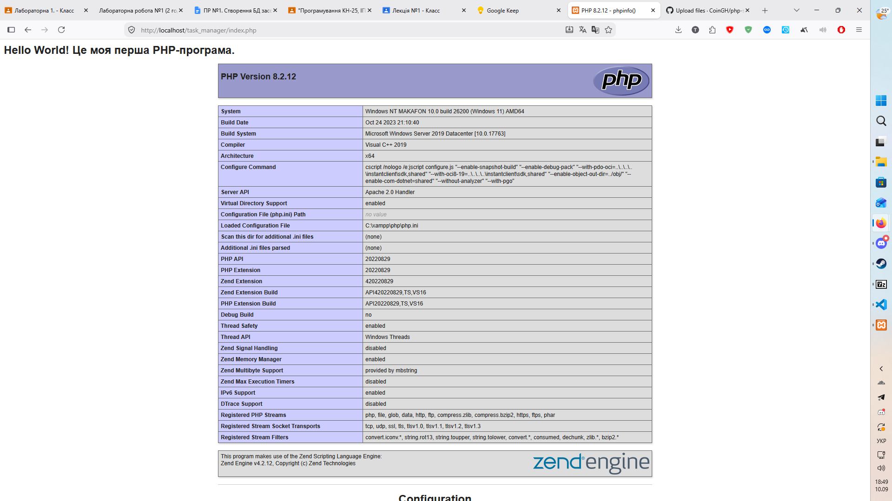

# Звіт до Лабораторної роботи №1

```php
<?php
    echo "<h1>Hello World! Це моя перша PHP-програма.</h1>";
    phpinfo();
?>
```


1. __Яке призначення вебсервера (наприклад, Apache) у процесі веброзробки?__

Вебсервер відповідає за обробку мережевих запитів клієнтів (браузерів) за протоколами HTTP/HTTPS. Його основні завдання:
- Прийняти вхідний запит від користувача.
- Визначити, який ресурс запитується (статичний файл чи динамічний скрипт).
- Якщо запитано PHP-файл — передати його інтерпретатору PHP для виконання, дочекатися результату генерації (зазвичай це HTML-код) і відправити його клієнту у відповіді.
- Керувати налаштуваннями маршрутизації, правами доступу, віртуальними хостами та заголовками відповідей.

2. __Яким розширенням файлу повинен володіти скрипт, щоб сервер обробив його як PHP-код?__

Файл повинен мати розширення .php. За цим розширенням вебсервер, через конфігурацію MIME-типів та модулів, таких як mod_php або PHP-FPM, визначає, що файл не можна просто віддавати клієнту у вигляді вихідного тексту, а потрібно спершу пропустити через інтерпретатор PHP.

3. __Чому PHP-файл потрібно відкривати через браузер за адресою localhost, а не просто подвійним кліком миші у файловому менеджері?__

Подвійний клік відкриває файл безпосередньо у браузері через локальний файловий протокол (file:///). У цьому ланцюжку вебсервер та інтерпретатор PHP взагалі не задіяні. Оскільки браузери не вміють самостійно компілювати чи інтерпретувати PHP, вони або виведуть вихідний сирцевий код файлу як простий текст, або запропонують його завантажити.
Відкриття через localhost надсилає повноцінний мережевий HTTP-запит до локального вебсервера. Сервер запускає інтерпретатор PHP, код виконується на бекенді, а браузер отримує вже чистий HTML-результат.

4. __За що відповідає конструкція echo у PHP?__

echo — це мовна конструкція, яка слугує для виведення даних у вихідний потік. Вона приймає рядки, числа, значення змінних або HTML-розмітку й додає їх до тіла HTTP-відповіді, яку сервер надсилає браузеру.

5. __Яку інформацію виводить функція phpinfo() і для чого вона може знадобитись?__

Функція phpinfo() виводить детальну структуровану сторінку про поточний стан середовища виконання PHP:
- Точну версію PHP та дату її збірки.
- Шляхи до активних файлів конфігурації (зокрема php.ini).
- Значення всіх директив конфігурації (як глобальних, так і локальних).
- Список встановлених та активованих розширень і модулів (PDO, OpenSSL, cURL, GD тощо).
- Інформацію про вебсервер, операційну систему, змінні середовища та HTTP-заголовки.
Вона необхідна для діагностики проблем, перевірки доступності потрібних бібліотек і налагодження вебсервера під час розгортання проєкту.
