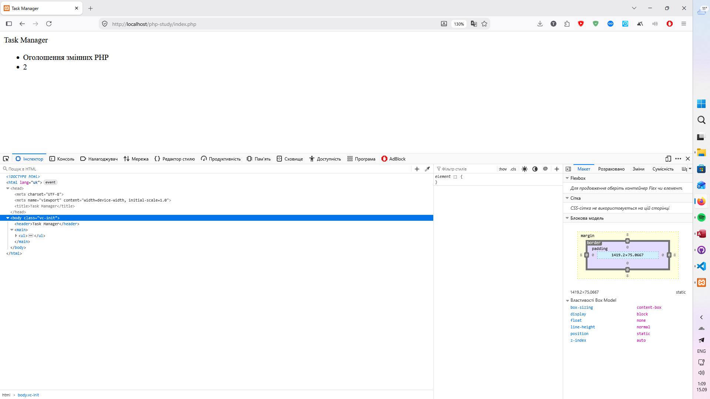

# Звіт до Лабораторної роботи №2

```php

<?php

$appName = "Task Manager";
$taskTitle = "Оголошення змінних PHP";
$taskTimeEstimate = 2;

?>
<!DOCTYPE html>
<html lang="uk">
<head>
    <meta charset="UTF-8">
    <meta name="viewport" content="width=device-width, initial-scale=1.0">
    <title><?= $appName ?></title>
</head>
<body>
    <header>
        <h1><?= $appName ?></h1>
    </header>
    <main>
        <ul>
            <li><?= $taskTitle ?></li>
            <li><?= $taskTimeEstimate ?></li>
        </ul>
    </main>
</body>
</html>

```


## Відповіді на питання:

1. __Що таке динамічна типізація і як вона працює в PHP?__

Динамічна типізація означає, що тип змінної не фіксується під час її оголошення, а визначається автоматично під час виконання програми залежно від присвоєного значення. У PHP немає потреби явно вказувати тип перед назвою змінної. Більше того, тип однієї й тієї ж змінної може змінюватися протягом роботи скрипту: якщо спочатку змінній присвоїти число, а наступним рядком записати рядок, інтерпретатор без помилок змінить її тип. Також PHP підтримує автоматичне приведення типів під час обчислень, коли інтерпретатор самостійно конвертує операнди до потрібного типу відповідно до оператора, що використовується.

2. __Як правильно розпочати і закрити блок з PHP-кодом всередині HTML-документа?__

Для відкриття блоку PHP використовується тег <?php, а для закриття — ?>. Коли інтерпретатор обробляє документ, він перемикається в режим виконання коду після зустрічі відкриваючого тегу і повертається до звичайної видачі HTML-розмітки після закриваючого. Закриваючий тег є обов'язковим у тих випадках, коли після блоку PHP у документі продовжується розмітка HTML або інший статичний текст.

3. __В чому різниця між записами <?php echo $var; ?> та <?= $var ?>?__

Обидва записи виконують одну й ту саму дію — виводять значення змінної. Конструкція <?= $var ?> є скороченим синтаксисом команди виводу, створеним для спрощення шаблонізації та покращення читабельності HTML-файлів. На відміну від застарілих скорочених відкриваючих тегів, починаючи з версії PHP 5.4 короткий запис <?= доступний завжди і працює незалежно від налаштувань директиви short_open_tag у конфігурації сервера.

4. __Які основні (скалярні) типи даних підтримує PHP? Наведіть приклади.__

До скалярних належать типи даних, що зберігають лише одне неподільне значення. У PHP їх чотири:

    - Логічний тип boolean, що приймає значення істини або хиби, наприклад $isActive = true;

    - Цілі числа integer, наприклад $count = 15;

    - Дійсні числа з плаваючою крапкою float, наприклад $price = 49.90;

    - Рядки string, що містять послідовність символів, наприклад $name = "Іван";

5. __Що буде виведено в браузері, якщо користувач відкриє файл .html, всередині якого буде вбудовано <?php echo "Test"; ?> без налаштувань сервера? Поясніть чому.__

У браузері рядок "Test" виконаний не буде. Користувач побачить порожнє місце або сирі уламки тексту на кшталт Test"; ?>, а весь фрагмент коду залишиться відкритим у вихідному коді сторінки. Це відбувається тому, що веб-сервер за замовчуванням сприймає файли з розширенням .html як статичний контент і віддає їх клієнту безпосередньо, не викликаючи інтерпретатор PHP. Якщо ж файл відкрито просто з диска через провідник, сервер у процесі взагалі не бере участі. Сам браузер виконувати PHP не вміє: натрапивши на невідомий тег <?php, його парсер або приховує такий фрагмент як нерозпізнаний вузол розмітки, або перетворює його на коментар.