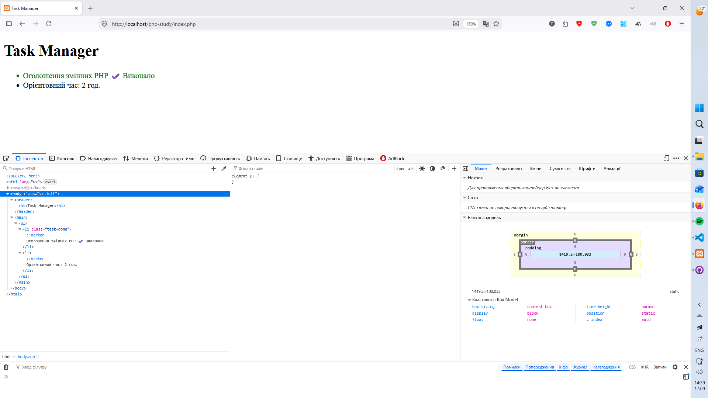

# Звіт до Лабораторної роботи №3

```php

<?php

$appName = "Task Manager";
$taskTitle = "Оголошення змінних PHP";
$taskTimeEstimate = 2;

$isCompleted = true;

?>

<!DOCTYPE html>
<html lang="uk">
<head>
    <meta charset="UTF-8">
    <meta name="viewport" content="width=device-width, initial-scale=1.0">
    <title><?= $appName ?></title>
    <style>
        .task-done {
            color: green;
            -webkit-text-stroke: 0.1px black;
        }
        .task-pending {
            color: gray;
        }
    </style>
</head>
<body>
    <header>
        <h1><?= $appName ?></h1>
    </header>
    <main>
        <ul>
            <li class="<?= $isCompleted ? 'task-done' : 'task-pending' ?>">
                <?= $taskTitle ?> 
                <?php if ($isCompleted): ?>
                    ✔️ Виконано
                <?php else: ?>
                    🕒 В процесі
                <?php endif; ?>
            </li>
            <li>Орієнтовний час: <?= $taskTimeEstimate ?> год.</li>
        </ul>
    </main>
</body>
</html>

```



## Відповіді на питання:

1. __Які оператори порівняння існують у PHP (назвіть мінімум 4)?__

- Рівність == — перевіряє рівність значень після автоматичного приведення типів;

- Тотожна рівність === — перевіряє рівність значень і збіг їхніх типів даних;

- Нерівність != або <> — перевіряє нерівність значень з приведенням типів;

- Тотожна нерівність !== — перевіряє нерівність значень або невідповідність типів;

- Порівняння величин >, <, >=, <= — оператори «більше», «менше», «більше або дорівнює» та «менше або дорівнює»;

2. __У чому різниця між тотожним порівнянням (===) та звичайним прирівнюванням (==) у PHP? Наведіть приклад, де результати відрізнятимуться.__

Звичайне порівняння == виконує неявне приведення типів: якщо типи операндів різні, інтерпретатор спочатку перетворює їх до спільного типу і лише після цього порівнює самі значення. Тотожне порівняння === жодного приведення типів не виконує — воно повертає true тільки тоді, коли обидва операнди мають однаковий тип даних і однакове значення.

Приклад, де результати відрізняються:
Вираз "10" == 10 поверне true, оскільки рядок "10" перед порівнянням автоматично перетворюється на число.
Вираз "10" === 10 поверне false, оскільки рядок string і ціле число integer належать до різних типів.

3. __Для чого потрібен альтернативний синтаксис керуючих конструкцій (if (...): … endif;) під час роботи з HTML?__

Альтернативний синтаксис створений для змішування PHP-коду зі статичною версткою в HTML-шаблонах. Він замінює відкриваючі та закриваючі фігурні дужки {} на двокрапку : та явні інструкції завершення: endif;, endfor;, endforeach;, endwhile;. Це суттєво підвищує читабельність коду, оскільки серед десятків закриваючих HTML-тегів розробнику легше орієнтуватися за словом endif;, ніж за поодинокою фігурною дужкою }, а також одразу видно, яка саме керуюча конструкція завершується.

4. __Що таке тернарний оператор і який він має синтаксис? Коли його використання є недоцільним?__

Тернарний оператор — це компактна форма запису базового розгалуження if-else, яка повертає один із двох виразів залежно від результату умови.

Його синтаксис: умова ? вираз_якщо_true : вираз_якщо_false;

Використання тернарного оператора є недоцільним у випадках, коли всередині умов або результатів виконується складна обчислювальна логіка, а також при спробах вкласти один тернарний оператор в інший. Вкладені тернарні вирази перевантажують код, ускладнюють його відлагодження і сприйняття, тому для складної логіки слід використовувати класичний блок if-else або конструкцію switch/match.

5. __Які значення в PHP приводяться до false при перетворенні типів (type juggling) в умові if?__

Під час перетворення до булевого типу в умові if хибними (false) вважаються такі значення:

- саме логічне значення false;

- ціле число 0;

- дійсні числа 0.0 та -0.0;

- порожній рядок "";

- рядок, що містить один символ нуля "0";

- порожній масив [];

- тип null, а також значення неоголошених змінних.