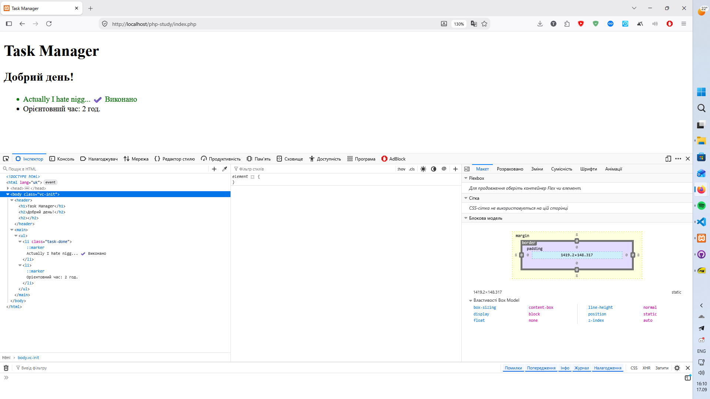

# Звіт до Лабораторної роботи №4

```php

$taskTitle = "Actually I hate niggle!";
date_default_timezone_set('Europe/Kyiv');

function formatTitle($text, $maxLength = 20) {
    if (strlen($text) > $maxLength) {
        return substr($text, 0, $maxLength) . '...';
    }
    return $text;
}

function getCurrentGreeting() {
    $currentTime = date('H');
    $result = "Доброї ночі";
    if (6 <= $currentTime && $currentTime < 12) {
        $result = "Доброго ранку";
    } elseif (12 <= $currentTime && $currentTime < 18) {
        $result = "Добрий день";
    } elseif (18 <= $currentTime && $currentTime < 24) {
        $result = "Добрий вечір";
    }
    return $result;
}

```



## Відповіді на питання:

1. __Поясніть принцип “DRY” (Don’t Repeat Yourself) та як власні функції допомагають його дотримуватись.__

Принцип DRY вимагає уникати дублювання логіки в коді: кожна частина знань або алгоритму повинна мати єдине та чітке представлення в системі. Власні функції дозволяють інкапсулювати повторювані операції в один іменований блок. Замість багаторазового копіювання однакових рядків коду програміст викликає створену функцію в потрібних місцях. Це значно спрощує підтримку та тестування проекту: якщо в логіку необхідно внести зміни або виправити помилку, редагування виконується лише один раз у тілі самої функції, а не по всьому коду програми.

2. __Що таке аргументи функції та що таке параметри за замовчуванням? Наведіть приклад з коду.__

Параметри — це змінні, зазначені в оголошенні функції, які визначають, які дані функція очікує отримати. Аргументи — це конкретні значення або змінні, які фактично передаються у функцію під час її виклику.

Параметри за замовчуванням мають заздалегідь визначене значення в сигнатурі функції. Якщо під час виклику відповідний аргумент не було передано, функція автоматично використовує вказане за замовчуванням значення.

```php

    function formatTitle($text, $maxLength = 20)
    // $text — обов'язковий параметр, $maxLength — параметр за замовчуванням

```

3. __Що станеться, якщо у функції не написати конструкцію return, але спробувати присвоїти результат її виклику в змінну x ($x = myFunc())? Яке значення буде в $x?__

Якщо тіло функції виконується до кінця без виклику оператора return або якщо виконано порожній return;, PHP не викликає помилки (за умови, що для функції не вказано суворий тип повернення, відмінний від void/mixed). За замовчуванням така функція повертає значення null. Відповідно, змінна $x отримає значення null.

4. __Що таке “область видимості” (scope) змінної? Чи можна у тілі функції звернутись до $taskTitle, створеної за межами цієї функції, без ключового слова global?__

Область видимості — це контекст програми, у межах якого змінна була оголошена і залишається доступною для читання та модифікації. У PHP користувацькі функції мають власну ізольовану локальну область видимості, тому змінні із зовнішнього глобального контексту всередині функції за замовчуванням недоступні.

Пряме звернення за ім'ям $taskTitle безпосередньо в тілі функції призведе до попередження про неоголошену змінну (Undefined variable) та поверне null. Проте отримати доступ до цієї змінної без ключового слова global технічно можливо двома іншими шляхами:
- Через суперглобальний масив $GLOBALS['taskTitle']
- Шляхом передачі $taskTitle у функцію як вхідного аргументу під час виклику (що є найкращою інженерною практикою)

5. __Для чого призначена вбудована функція substr() і які вона умовно приймає аргументи?__

Функція substr() призначена для виділення та повернення частини рядка (підрядка) із заданого тексту.

Вона приймає три аргументи:

- Рядок-джерело ($string) — вхідний текст, з якого вилучається фрагмент.

- Зсув або початкова позиція ($offset) — індекс символу, з якого починається вибірка (нумерація з нуля; якщо число від'ємне, відлік ведеться з кінця рядка).

- Довжина ($length) — необов'язковий аргумент, що задає максимальну кількість символів для повернення (якщо аргумент не передано, повертається весь залишок рядка до кінця; якщо вказано від'ємне число, з кінця підрядка відкидається відповідна кількість символів).