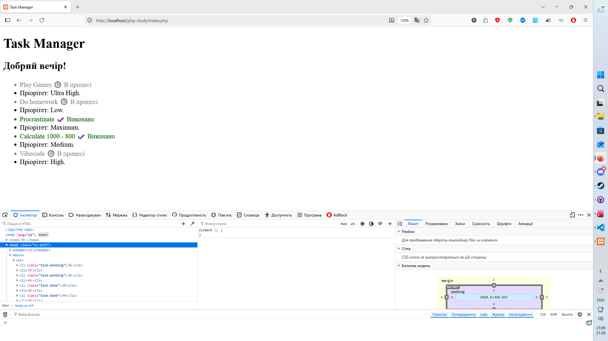

# Звіт до Лабораторної роботи №5

```php


```


## Відповіді на питання:

1. __В чому принципова різниця між індексованими та асоціативними масивами в PHP? Наведіть фрагменти коду з прикладами.__

Принципова різниця полягає у типі ключів, які використовуються для адресації та доступу до елементів. В індексованих масивах ключами є цілі числа, які за замовчуванням присвоюються автоматично, починаючи з нуля. В асоціативних масивах ключами виступають текстові рядки, що утворюють пари «ключ-значення» і дозволяють прив'язати елементи до зрозумілих назв.

```php

// Індексований масив
$colors = ["червоний", "зелений", "синій"];
echo $colors[0]; // виведе: червоний

// Асоціативний масив
$student = [
    "name" => "Олексій",
    "group" => "КН-21",
    "course" => 2
];
echo $student["name"]; // виведе: Олексій

```

2. __Які ключові компоненти містить цикл foreach? Чому його використання для масивів є кращим за цикл for?__

Ключові компоненти циклу foreach:

- Вхідний масив або ітерований об'єкт, по якому здійснюється прохід.

- Змінна для поточного значення елемента.

- Опціональна змінна для ключа елемента у конструкції $key => $value.

- Тіло циклу з командами, що виконуються на кожній ітерації.

Використання foreach є кращим за for з кількох причин:

- Він не потребує попереднього підрахунку кількості елементів і ручного керування лічильником ітерацій.

- Він коректно обробляє асоціативні масиви, де текстові ключі неможливо перебрати звичайним числовим індексом.

- Він безпечно працює з розрідженими масивами, у яких числові індекси йдуть не поспіль або деякі з них були видалені.

- Код стає значно чистішим і захищеним від типових помилок виходу за межі діапазону.

3. __Що буде, якщо у foreach звернутися до ключа, якого не існує в асоціативному масиві (наприклад, ```$task['deadline']```)?__

У такому разі інтерпретатор поверне значення null, а також згенерує попередження рівня Warning: ```Undefined array key "deadline"``` (_у версіях PHP до 8.0 генерувалося сповіщення Notice: Undefined index_).

Скрипт не припинить виконання фатальною помилкою, проте службове повідомлення може потрапити у фінальну верстку або в лог помилок сервера. Щоб уникнути подібних помилок, використовують попередню перевірку через функцію ```isset($task['deadline'])``` або оператор злиття з null: ```$task['deadline'] ?? 'немає'```.

4. __Для чого ми використовуємо альтернативний синтаксис endforeach; замість фігурних дужок ```}``` в HTML-шаблонах?__

Альтернативний синтаксис ```foreach (...): ... endforeach;``` використовується для підвищення читабельності та спрощення навігації по коду, коли PHP змішується з розміткою HTML. У шаблонах з великою кількістю вкладених тегів одиночні закриваючі фігурні дужки ```}``` губляться у верстці, що ускладнює пошук відповідного початку блоку. Конструкція ```endforeach;``` явно вказує на місце завершення конкретного циклу перебору і знижує ймовірність синтаксичних помилок під час редагування HTML.

5. __Наведіть мінімум 3 приклади корисних вбудованих функцій PHP для роботи з масивами (наприклад, для кількості, сортування тощо) та коротко опишіть їх.__

- `count($array)` — обчислює та повертає загальну кількість елементів у масиві.

- `in_array($needle, $haystack)` — перевіряє, чи присутнє вказане значення в масиві, повертаючи логічне true або false.

- `sort(&$array)` — сортує елементи масиву за зростанням значень і автоматично змінює числові ключі на нові.

- `array_key_exists($key, $array)` — перевіряє наявність заданого ключа або індексу в масиві незалежно від того, чи є його значення null.