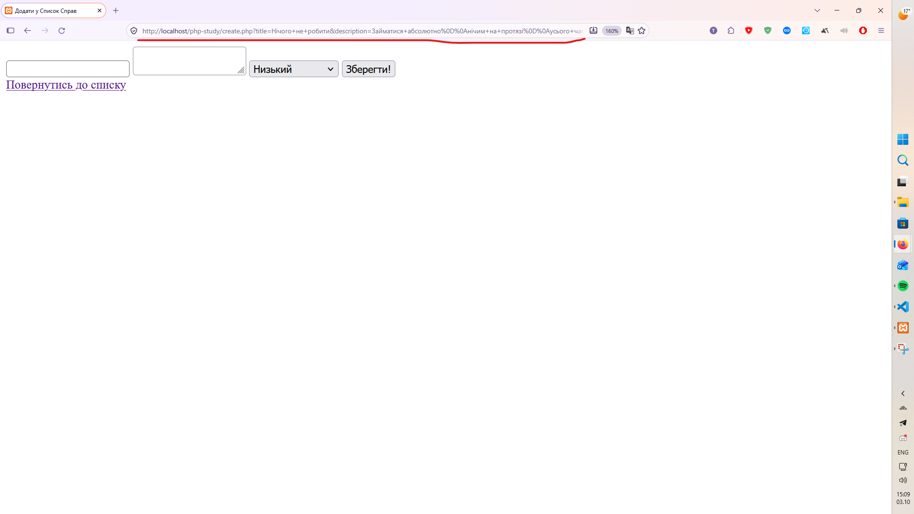
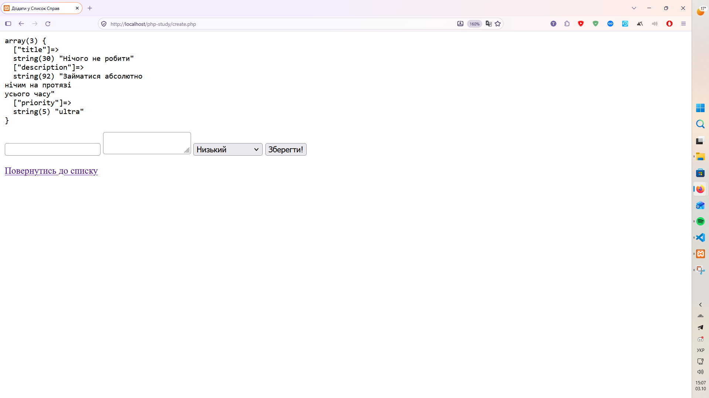

# Звіт до Лабораторної роботи №6

## Фрагмент коду з формою

```html

    <form action="create.php" method="POST">
        <input type="text" name="title">
        <textarea name="description"></textarea>
        <select name="priority">
            <option value="low">Низький</option>
            <option value="medium">Середній</option>
            <option value="high">Високий</option>
            <option value="ultra">Ультра</option>
            <option value="maximum">Максимальний</option>
        </select>
        <button type="submit">Зберегти!</button>
    </form>
    <a href="index.php">Повернутись до списку</a>

```

## Фото з GET



_Після відправки форми методом GET дані з'явились в адресному рядку у вигляді `create.php?title=...&description=...&priority=...` Масив `$_POST` порожній, бо дані лежать у `$_GET`._

## Фото з POST



_Після відправки методом POST адресний рядок лишився чистим (create.php), а `var_dump($_POST)` вивів на сторінці масив з ключами __title__, __description__ і __priority__._

## Відповіді на питання:

1. __Назвіть 3 ключові відмінності між HTTP-методами GET та POST під час передачі даних з форми.__

Перша: GET передає дані в адресному рядку, а POST в тілі запиту, тому в URL їх не видно. Друга: довжина URL обмежена, а для POST обмеження практично немає. Третя: GET запит можна зберегти в закладки, кешувати і безпечно повторювати, а POST браузер кешувати не буде, а при оновленні сторінки перепитає, чи відправляти форму ще раз.

2. __Вкажіть, в яких ситуаціях передача даних методом GET (відкритим текстом в URL) є прийнятною, і чому не можна передавати таким чином паролі.__

GET підходить для пошуку, фільтрів, сортування і пагінації. Це дані, які не секретні і якими корисно ділитися посиланням. Паролі так передавати не можна, бо вони лишаються в історії браузера, потрапляють у логи сервера і їх видно будь-кому, хто дивиться на екран.

3. __За що відповідає HTML-атрибут action у тегу `<form>`?__

Він вказує адресу файлу на сервері, який отримає і обробить дані форми. Якщо вказати create.php, дані прийде обробляти тому ж файлу.

4. __За яким критерієм PHP асоціюватиме дані з форми з ключами у масиві `$_POST` (які HTML атрибути тут вирішальні)?__

Вирішальний атрибут name. Його значення стає ключем масиву, а те, що ввів користувач, стає значенням. Без name поле на сервер не потрапить. А те, в який масив ляжуть дані, залежить від атрибута method.

5. __Назвіть призначення функції `var_dump()` та тегу `<pre>`. Чи використовується цей код у продуктовому (Production) середовищі для реальних клієнтів?__

`var_dump()` показує тип і значення змінної чи елементів масиву, тому його зручно використовувати для перевірки, що саме прийшло на сервер. Тег `<pre>` зберігає відступи та переноси рядків, і вивід читається нормально, а не зливається в один рядок. У продакшені цей код не використовують, бо це інструмент для розробника. Звичайним користувачам він не потрібен, а ще може показати зайву внутрішню інформацію.