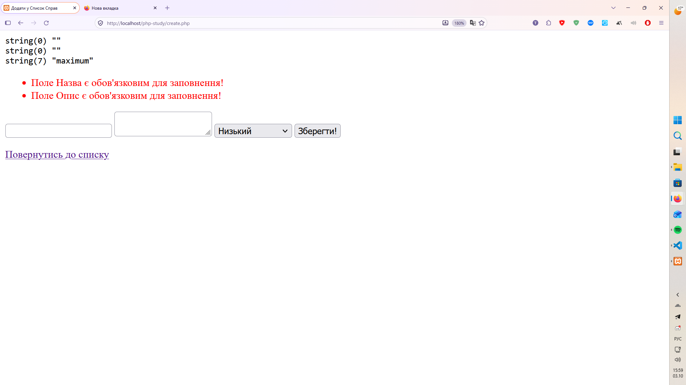
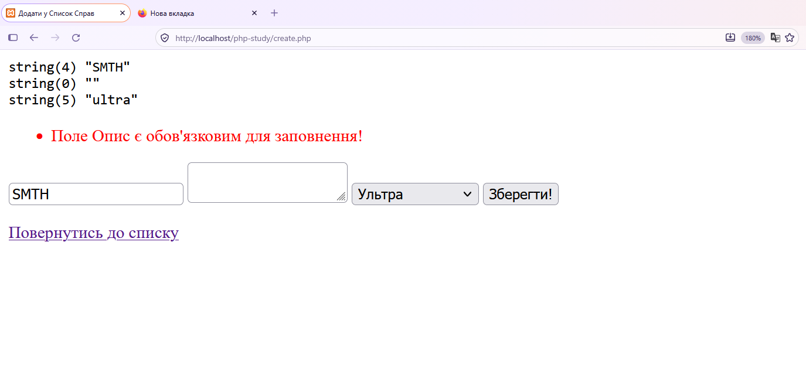

# Звіт до Лабораторної роботи №7

## Фрагмент коду блоку валідації

```php

if ($_SERVER['REQUEST_METHOD'] === 'POST') {
    $errors = [];

    echo "<pre>";
    $title = htmlspecialchars(trim($_POST['title']));
    $description = htmlspecialchars(trim($_POST['description']));
    $priority = $_POST['priority'];

    if (empty($title)):$errors[] = "Поле Назва є обов'язковим для заповнення!"; endif;
    if (empty($description)):$errors[] = "Поле Опис є обов'язковим для заповнення!"; endif;

    var_dump($title, $description, $priority);
    echo "</pre>";
}

```

```php

<div class="alert">
        <ul>
            <?php if (!empty($errors)): foreach($errors as $error):?>
            <li class="error_li">
                <?= $error ?>
            </li>
            <?php endforeach; endif; ?>
        </ul>
    </div>

```

### Фото 1



## Фрагмент коду Sticky Forms

```php

<input type="text" name="title" value="<?php if (!empty($errors)):?><?= $title ?? "" ?><?php endif; ?>">
<textarea name="description"><?php if (!empty($errors)):?><?= $description ?? "" ?><?php endif; ?></textarea>

```

### Фото 2 (завдання із зірочкою)



## Відповіді на питання:

1. __У чому принципова різниця між валідацією на фронтенді (через атрибут `required` в HTML / або на JS) та на бекенді (PHP)?__

Фронтенд-валідація існує суто для зручності користувача, а бекенд-валідація — для безпеки. На фронті ми просто підказуємо людині, що вона пропустила поле або помилилася форматом, щоб заощадити її час і не ганяти зайвий трафік на сервер.

2. __Чому серверна валідація є критично необхідною з точки зору безпеки? Хто і як може обійти вашу HTML `required`-валідацію?__

Серверна перевірка критична, тому що клієнтська частина повністю підконтрольна користувачеві. Обійти `required` в HTML може хто завгодно за пару секунд: достатньо натиснути F12 у браузері, відкрити вкладку Elements і просто стерти атрибут required у тегу. Крім того, форму можна відправити взагалі без браузера - через консольні утиліти або скрипти. Якщо сервер сліпо довіряє всьому, що прийшло ззовні, база даних швидко засмітиться або виникне збій.

3. __Що робить функція `trim()`? Яку конкретну проблему (наприклад, при реєстрації пароля чи логіна) вона вирішує?__

Функція `trim()` видаляє пробіли, табуляції та невидимі переноси рядків з самого початку і кінця рядка. Вона вирішує дуже поширену проблему, коли людина копіює свій логін чи email із пошти чи блокнота і випадково захоплює пробіл наприкінці. Без `trim()` система збереже рядок разом із цим пробілом. Пізніше користувач вводитиме логін вручну без пробілу і просто не зможе потрапити в акаунт. Також `trim()` рятує від ситуацій, коли користувач намагається обдурити форму, відправивши замість тексту кілька натискань клавіші "пробіл".

4. __Від чого захищає функція `htmlspecialchars()`? Наведіть приклад “поганого” тексту, який міг би зламати відображення сайту без цього захисту.__

Функція `htmlspecialchars()` захищає від атак типу XSS і псування структури сайту. Вона перетворює спеціальні символи розмітки на безпечний текст: наприклад, знак "менше" перетворюється на спецсимвол для браузера, а лапки стають безпечними сутностями.

Без цієї функції будь-який відвідувач може надіслати в коментарях або імені профілю такий текст:
`</div><script>alert('404')</script>`

Якщо вивести цей текст на сторінку напряму, закриваючий тег передчасно розірве розмітку вашого сайту і верстка "попливе", а браузер спробує виконати скрипт усередині. Завдяки `htmlspecialchars()` цей код відобразиться на екрані просто як звичайні друковані літери і буде безпечним.

5. __Що таке масив помилок (Error Bag) і чому краще збирати всі помилки та показувати їх одночасно, а не використовувати `die()` чи `exit()` при першій-ліпшій невідповідності?__

Масив помилок — це звичайний список або асоціативний масив на бекенді, куди ви поступово складаєте знайдені проблеми під час повної перевірки форми.

Збирати помилки разом значно краще, ніж одразу обривати роботу через `die()` або `exit()`:

- Людина одразу бачить повний список зауважень і виправляє їх за один підхід.

- Використання `die()` просто вбиває сторінку, і користувач втрачає все, що друкував. З масивом помилок ви можете повернути людину назад на гарну форму, підсвітити потрібні інпути червоним і залишити введений раніше текст на місці.