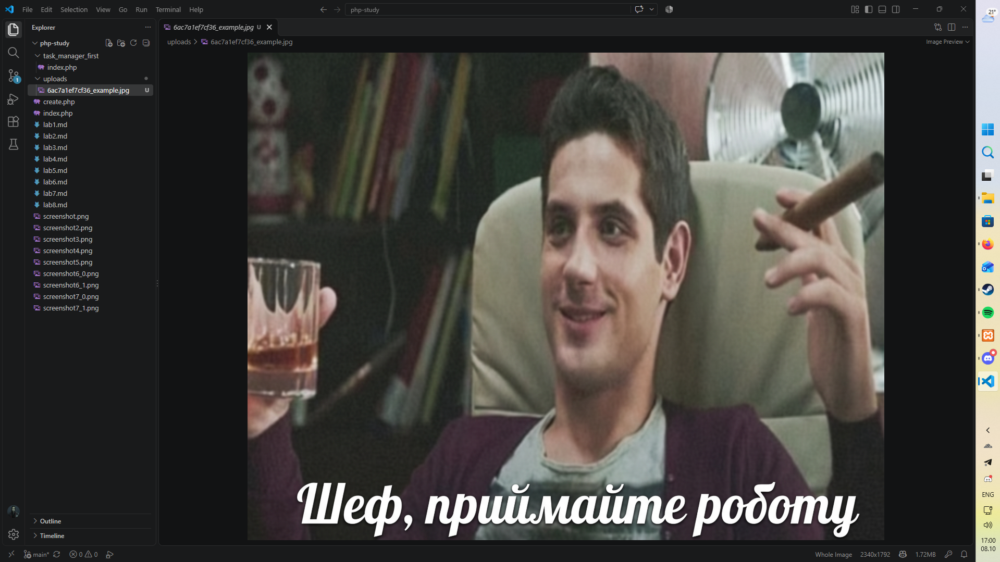
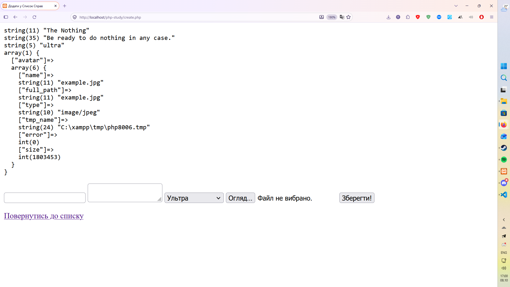

# Звіт до Лабораторної роботи №8

## Фрагмент коду

```php

if ($_SERVER['REQUEST_METHOD'] === 'POST') {
    $errors = [];
    $extensions = ['jpg', 'jpeg', 'png'];

    echo "<pre>";
    $title = htmlspecialchars(trim($_POST['title']));
    $description = htmlspecialchars(trim($_POST['description']));
    $priority = $_POST['priority'];
    $filename = $_FILES['avatar']['name'];
    $need_to_upload = true;

    if (empty($title)): $errors[] = "Поле Назва є обов'язковим для заповнення!"; $need_to_upload = false; endif;
    if (empty($description)): $errors[] = "Поле Опис є обов'язковим для заповнення!"; $need_to_upload = false; endif;
    if (isset($_FILES['avatar']) && $_FILES['avatar']['error'] === UPLOAD_ERR_OK) {
        if ($_FILES['avatar']['size'] <= 3 * 1024 * 1024) {
            if (in_array(pathinfo($filename, PATHINFO_EXTENSION), $extensions, true)) {
                if ($need_to_upload) {
                    move_uploaded_file($_FILES['avatar']['tmp_name'], 'uploads/' . uniqid() . '_' . $_FILES['avatar']['name']);
                }
            } else {
                $errors[] = "Неприпустиме розширення файлу!";
            }
        } else {
            $errors[] = "Файл завеликий!";
        }
    };

    var_dump($title, $description, $priority);
    var_dump($_FILES);
    echo "</pre>";
}

```

## Скриншот папки `uploads`



## Скриншот сторінки браузера



## Відповіді на питання:

1. __Що таке `enctype="multipart/form-data"` і чому його обов’язково треба використовувати в тегу `form` для файлів?__

За замовчуванням форма надсилає все як звичайний текст, де всі символи кодуються в один довгий рядок. Для звичайних полів з текстом цього вистачає, але файли складаються з бінарних даних, які так просто в рядок не запхнеш.

Якщо не прописати цей атрибут, браузер відправить на сервер тільки текстову назву файлу замість його вмісту. Атрибут вказує браузеру розділити тіло запиту на окремі частини, де кожне текстове поле і кожен файл летять окремим цілісним блоком зі своїми бінарними байтами.

2. __Які ключі завжди присутні в масиві для конкретного файлу в `$_FILES`? Опишіть призначення ключа `tmp_name`.__

У масиві файлу завжди є п'ять ключів: `name`, `type`, `tmp_name`, `error` та `size`.

Ключ `tmp_name` містить реальний шлях до тимчасового файлу на сервері. Коли браузер завантажує файл, PHP одразу ховає його в системну папку і дає випадкове ім'я. Оригінальна назва в ключі name потрібна лише для довідки, а вся реальна робота відбувається саме через `tmp_name`.

3. __Чому файли не зберігаються одразу у вашій папці проєкту після натискання `Submit`, а містяться в тимчасових директоріях операційної системи (`tmp_name`)?__

Сервер не може знати наперед, куди саме ви хочете покласти файл, чи залогінений користувач і чи взагалі пройшла валідація форми. Крім того, зв'язок може обірватися прямо посеред завантаження.

Тому операційна система спочатку приймає файл у тимчасовий буфер. Якщо ваш скрипт успішно перевірив файл і перемістив його, чудово. Якщо сталася помилка або скрипт просто завершив роботу і проігнорував завантаження, PHP автоматично прибере цей тимчасовий файл, щоб сервер не захлинувся від сміття.

4. __Для чого ми використовуємо функцію `move_uploaded_file()`? Чому не можна просто скопіювати файл звичайною функцією `copy()` без перевірок безпеки?__

Головна відмінність полягає в перевірці безпеки. Функція `move_uploaded_file()` перед переміщенням перевіряє внутрішні системні прапорці і гарантує, що файл дійсно прийшов через HTTP POST у поточному запиті.

Якщо взяти звичайний `copy()`, зловмисник може сфальсифікувати шлях у запиті. Тоді сервер замість завантаженого файлу спокійно скопіює внутрішній файл операційної системи чи конфіг бази даних прямо в публічну папку сайту.

5. __Які потенційні загрози несе дозвіл користувачам “завантажувати будь-що” на сервер (без перевірки розширення чи типу)?__

Якщо користувач завантажить звичайний PHP-скрипт або веб-шел у папку, яка відкрита для публічного доступу, йому достатньо просто перейти за прямим посиланням на цей файл у браузері. Сервер виконає його код, і людина отримає повний контроль над вашим проєктом, файловою системою та базою даних.

Без обмежень вам можуть забити весь жорсткий диск гігабайтними архівами, завантажити SVG-файл зі шкідливим JavaScript для крадіжки сесій або розповсюджувати віруси іншим користувачам вашого сайту.